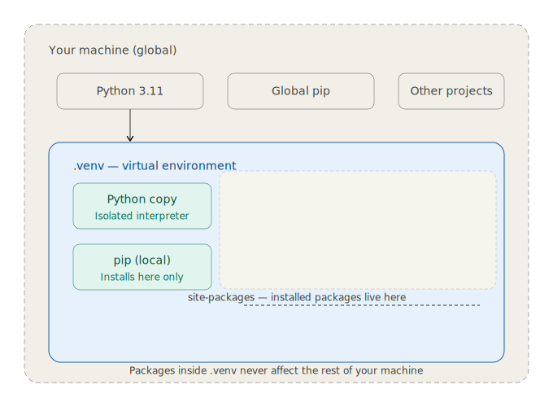

# 2. How to - Python Virtual Environment - Create & Activate
*By Dele Oke*


---


## 1. What is a Python Virtual Environment

The `venv` Python module supports creating lightweight “virtual environments”, each with their own independent set of Python packages installed in their site directories. 

`venv` are completely self-contained. No settings get written to some hidden registry, no system files get modified. Everything lives inside that one folder, so deleting the folder is a clean removal.




### Prerequisites

1. **VS Code** with the Python extension - `https://code.visualstudio.com/`
2. **Python 3.10+** installed on your system -`python.org`
3. **Git Bash** terminal (provides a consistent experience on both Mac and Windows) - `git-scm.com/`
4. VS Code Python Extension


---

## 2. Create & Activate one

We shall be using [Git Bash](https://git-scm.com/) - `git-scm.com`

```bash
# active the VE on  Git Bash
python -m venv .venv
```



`python` — calls the Python interpreter installed on your machine.

`-m` — tells Python to run a built-in module as a script. Think of it as saying "use one of Python's built-in tools."

`venv` — the specific module being run. It stands for "virtual environment" and has been built into Python since version 3.3.

`.venv` — the name of the folder that will be created to hold the environment. The dot at the start is a convention that makes the folder hidden on Mac/Linux, keeping your project folder tidy. You could name it anything (`env`, `myenv`, etc.), but `.venv` has become the community standard — VS Code even looks for it automatically.

```bash
python -m venv .venv        # create it
source .venv/bin/activate   # activate it (Mac/Linux)
source .venv/Scripts/activate      # activate it (Windows)

## Check activation worked
which python
```

## 3. Install dependencies
These will no go inside your `venv`

```bash
# Install pillow and check
pip install pillow
pip install piexif

## Check dependencies installed
pip list
which python

# when done
deactivate

# Save your packages for easy reinstall
pip freeze > requirements.txt

# Install from requirements
pip install -r requirements.txt 

# close the venv
deactivate

# Delete the venv (Only when you no longer require it)
rm -rf .venv
```
---------


## 4. Standard library modules 
These do not need to be installed. They come with python.
They just have to be imported.

**Examples of these are**

- os
- sys
- math
- json
- datetime
- random

**You can check the full list by running this script**

> check_modules.py

```python
import sys
for module in sys.stdlib_module_names:
    print(module)
```

Or check [Python Library](https://docs.python.org/3/library/)

## 5. VS Code and Virtual Environment

VS Code often detects a .venv folder and activates the viritual environment when the workspace is opened.  
However, on Windows, it depends on the user's PowerShell execution policy. If the policy restricts running scripts, the automatic activation can fail, and user may see an error like:

`cannot be loaded because running scripts is disabled on this system`

The fix on Windows is to run this once in PowerShell:
`Set-ExecutionPolicy -ExecutionPolicy RemoteSigned -Scope CurrentUser`

## 5. Running scripts on Virtual Environment

- Open a file with pillow
    [01 openImage.py](../workarea/01-openImage.py)

- Create thumbnail with pillow
    [01 thumbnail.py](../workarea/01-thumbnail.py)

- Convert jpg to png and resize with thumbnail
    [01 convertThumb.py](../workarea/01-convertThumbnail.py)